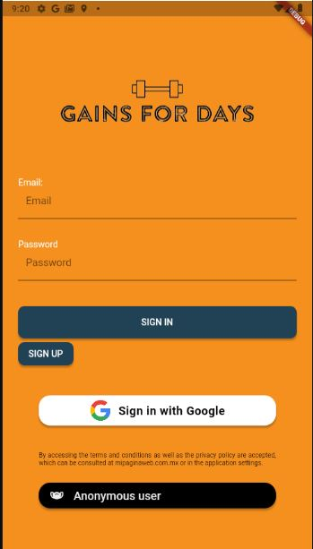
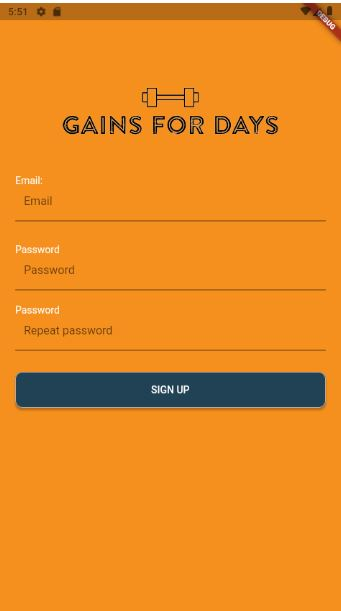
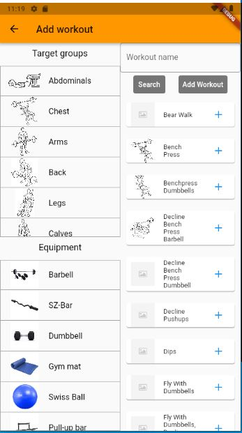

# Gains for Days Flutter application

## Descripción
Aplicación sencilla desarrollada en Flutter que busca ofrecer un repositorio de distintos ejercicios físicos con diferentes tipos de equipo; Estos ejercicios son obtenidos por medio de la API de  https://wger.de, la cual esta dedicada a ejercicios, nutrición y entrenamientos. También se ofrece la funcionalidad de poder crear y guardar en Firebase Cloud diferentes rutinas con los ejercicios que el usuario seleccione.

## Funcionalidades y desarrollo

### Entrega 1
* Vistas iniciales
* flujo de información y manejo de rutas

### Entrega 2
* Implementación manejo de estados: Uso de BloC en diversas vistas para manejo de estados y eventos
* Conexión a APIs: https://wger.de/es/software/api API Ejercicios
* Almacenamiento local: Uso de hive para almacenar los ejercicios localmente

### Entrega 3
* API Externa: https://wger.de/es/software/api API Ejercicios
* Integracion con Firebase: Autenticacion usuarios y uso de la nube
* Guardar y leer datos en la nube: Guardar, leer y eliminar rutinas
* Autenticacion de usuarios en la nube: Por correo y por Google
* Notificaciones y alertas: Aun no disponible, posiblemente cuando se suba una nueva imagen?
* Funcionamiento al 90%

## App Screenshots description
...

| Screenshot description |  
| :------------- |
|Welcome Screen: Inital welcome page. The user can login via Google, a vaild mail/password credential, or via anonymous.  |
|  |
|Register Screen: The user can create a valid email/password account. Both password must match and have more than 5 characters  |
|  |
|Exercises Menu Screen: Once logged in, this view will appear to the user. The user can select a category of exercises to explore, search exercises, logout, or go to the workouts view  |
|  |
|Exercise category Screen: If a category is selected - arms in this case-, the app will show all of the available arm axercises. |
|  |
|Exercise detail Screen: If an exercise is selected, another view will open with the details of the exercise.|
|  |
|Search exercise Screen: The user can search an exercise by the category and/or the equipment it requires.|
|  |
|Search exercise Screen: This view shows the result of searching chest exercises that use dumbbells as equipment|
|  |
|Workout Menu Screen: The workout view shows all of the workouts that a user has created. It shows the option to reload the view, or create a new workout. Each workout has the option to be deleted, and if selected, a new view will be created with the workout details |
|  |
|Add workout screen: Similar to the search exercise screen, the user can search the exercises to add to the workout, insert a workout title, and create the workout|
|  |
|Show workout screen: This shows the exercises that make up the workout. If an exercise is selected, the exercise detail screen will pop up|
|  |

