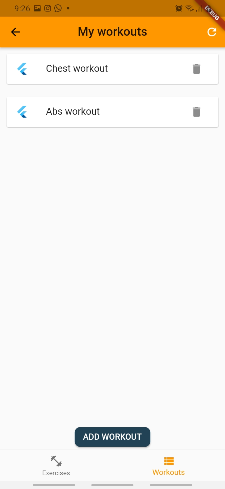
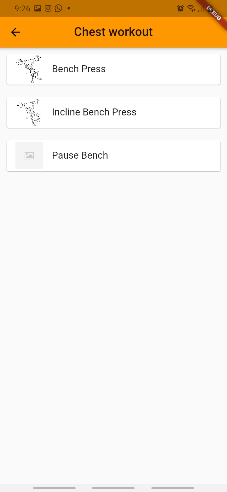

# Gains for Days Flutter application

## Descripción
Aplicación sencilla desarrollada en Flutter que busca ofrecer un repositorio de distintos ejercicios físicos con diferentes tipos de equipo; Estos ejercicios son obtenidos por medio de la API de  https://wger.de, la cual esta dedicada a ejercicios, nutrición y entrenamientos. También se ofrece la funcionalidad de poder crear y guardar en Firebase Cloud diferentes rutinas con los ejercicios que el usuario seleccione.

## Funcionalidades y desarrollo

### Entrega 1
* Vistas iniciales
* flujo de información y manejo de rutas

### Entrega 2
* Implementación manejo de estados: Uso de BloC en diversas vistas para manejo de estados y eventos
* Conexión a APIs: https://wger.de/es/software/api API Ejercicios
* Almacenamiento local: Uso de hive para almacenar los ejercicios localmente

### Entrega 3
* API Externa: https://wger.de/es/software/api API Ejercicios
* Integracion con Firebase: Autenticacion usuarios y uso de la nube
* Guardar y leer datos en la nube: Guardar, leer y eliminar rutinas
* Autenticacion de usuarios en la nube: Por correo y por Google
* Notificaciones y alertas: Aun no disponible, posiblemente cuando se suba una nueva imagen?
* Funcionamiento al 90%

## App Screenshots
...

